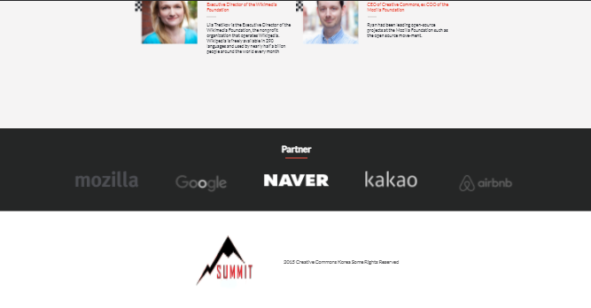

# Conference page
> This is the work presented as a final project for the CSS/HTML module.
> The project is supposed to be personalized and the topic chosen is about fictional Yoga Retreat. Photos and Dates are not real. 
> The project Design followed Cindy Shin's [template](https://www.behance.net/gallery/29845175/CC-Global-Summit-2015)

# Project contains several sections:

- Header with social icons, logo and navigation
- Headline 
- Program section
- Featured Speakers section
- Partners section
- Footer
## Built With

- Html
- css
- Linter
  -JavaScript

# Built with
- HTML5
- CSS3
- JavaScript
- Git and GitHub
- VScode

# Live Demo
> Project live demo [link](https://meqdamalqudah.github.io/Conference-page-project/);
> video presentation [link](https://www.loom.com/share/d5f199304bf24e8291d892d8a3795851);

# Getting Started
## Prerequisites:

- Create an account on github

- Install gitbash or use git on the command line.

- Use an IDE of your preference such as VScode.

## Steps to follow:

- Choose the repository

- Choose a folder in your local machine where you want this repository to be copied

- Clone the repository to your locaL machine.
It should look similar to this git clone https://github.com/smithj/azure-docs.git Enter your github credentials if prompted.

- Open the index.html file with the browser of your preference.
## Authors

👤 **Meqdam Al-qudah**

- [GitHub](https://github.com/MeqdamAlqudah)
- [Twitter](https://twitter.com/MeqdamQudah)
- [LinkedIn](www.linkedin.com/in/meqdam-al-qudah-7514a21b5)

# Acknowledgments
- Cindy Shin whose design template was used to create this project.
- Unsplash for providing content related free pictures.
- Thanks to my teammates, learning and coding partners.

# License
This project is MIT licensed.

