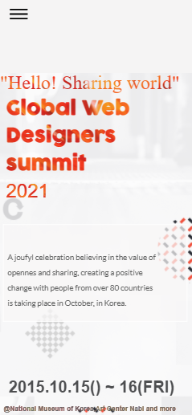
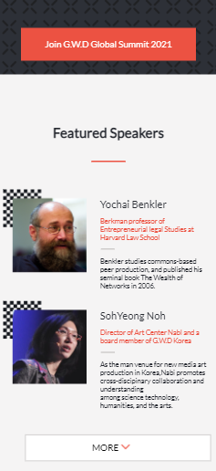
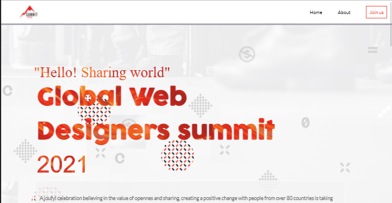

# Project Name

Conference page

# PR

Basic design of the home page :
1-A small paragraph about the summit
2-the date of the summit
3 main program in the summit
4- Speakers who will give a nice speach in the summit

Basic design or the About page:
1- Add small paragraph
2- Add a logo for the summit
3- Add a pictures about past summit
4- add the partner's

## Built With

- Html
- css
- Linter
  -JavaScript

## Deployed version

https://meqdamalqudah.github.io/Conference-page-project/

## Getting Started

-open the index.html file in chrome and see the project

### Setup

-click the green code button in the repo and then download the files or you can clone the repo using Git.

#### To get a local copy up and running follow these simple example steps.

- Click the green `Code` button on the repo and copy link
- In your local PC, open your terminal in the folder you would like to clone the project.
- Clone the repo with the command: `git clone (copied link)`; like so: `git clone https://github.com/MeqdamAlqudah/Conference-page-project.git`
- On the terminal, navigate into the directory like so: `cd Portfolio-setup-and-mobile-version-skeleton`

### Prerequisites

Chrome or any explorer

## Authors

👤 **Meqdam Al-qudah**

- [GitHub](https://github.com/MeqdamAlqudah)
- [Twitter](https://twitter.com/MeqdamQudah)
- # [LinkedIn](www.linkedin.com/in/meqdam-al-qudah-7514a21b5)

## "Acknowledgements"

UI design credit :

- Cindy Shin
  cc logo Attribution-NonCommercial 4.0 International (CC BY-NC 4.0)
